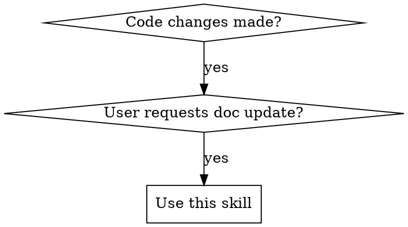

# Claude Change Documentation

## Overview
Keeps `./claude` directory documentation synchronized with code changes. The `./claude` directory contains project-specific AI context (CLAUDE.md, patterns/, context files) that must stay in sync with the codebase.

## When to Use



**Use when:**
- User explicitly asks: "update docs in ./claude", "sync documentation", "update CLAUDE.md"
- After adding/modifying components, APIs, or architecture
- After changing development conventions or patterns
- When code and documentation have diverged

**Don't use when:**
- Creating new documentation from scratch (use writing-skills)
- User hasn't requested documentation update
- Documentation is outside `./claude` directory

## Quick Reference

| Code Change | Documentation Update |
|-------------|---------------------|
| New component | Add entry to `CLAUDE.md` + create `patterns/component-name.md` |
| API change | Update API section in component pattern doc + main CLAUDE.md |
| Architecture change | Update architecture section in CLAUDE.md |
| Convention change | Update "开发约定" or equivalent section |
| New utility function | Add to tools/utils section in CLAUDE.md |

## Core Pattern

### 1. Verify Code Changes First
Always read the actual code files to understand what changed. Don't rely solely on user descriptions.

```
git diff or read files → identify exact changes → verify implementation
```

### 2. Map Changes to Documentation

**For each changed file:**
1. Identify the file type (component, utility, API, etc.)
2. Find corresponding documentation in `./claude`
3. Determine which sections need updates

**Documentation mapping:**
```
src/components/ComponentName.tsx → claude/patterns/component-name.md + CLAUDE.md
src/utils/tool.ts → CLAUDE.md (工具函数 section)
src/api/endpoint.ts → CLAUDE.md (API section)
```

### 3. Update Documentation Hierarchy

**Two-level structure:**

1. **CLAUDE.md** - Project overview and navigation
   - Brief descriptions (1-2 lines per item)
   - Links to detailed documentation
   - Architecture and conventions

2. **patterns/** - Detailed component/API documentation
   - Full API documentation
   - Usage examples
   - Implementation details

**Update order:**
1. Update detailed documentation in `patterns/` first
2. Then update summary in `CLAUDE.md`
3. Verify consistency between both levels

### 4. Verification Checklist

After updating documentation, verify:

- [ ] All changed code has corresponding documentation updates
- [ ] API signatures match (parameter names, types, defaults)
- [ ] Examples are accurate and runnable
- [ ] CLAUDE.md and patterns/ are consistent
- [ ] No outdated information remains
- [ ] TypeScript types/interfaces are documented (if applicable)
- [ ] Test files checked for usage patterns (if they exist)

## Implementation

### Step 1: Analyze Changes
```bash
# Check git diff or read changed files
git diff src/
# or
Read src/components/Button.tsx
```

### Step 2: Find Documentation
```bash
# Locate related docs
Glob "claude/**/*.md"
Grep "Button" claude/
```

### Step 3: Update Documentation
Update detailed docs first, then summaries.

### Step 4: Verify
Cross-reference code and documentation for consistency.

## Common Mistakes

| Mistake | Fix |
|---------|-----|
| Updating only CLAUDE.md, skipping patterns/ | Always update both levels |
| Not verifying actual code changes | Read code files before updating docs |
| Relying on descriptions instead of code | Always verify implementation exists |
| Forgetting to update API signatures | Check parameter names, types, defaults |
| Leaving outdated information | Remove or update all references to changed APIs |
| Adding implementation details to CLAUDE.md | Keep CLAUDE.md high-level, details in patterns/ |
| Missing TypeScript interfaces | Copy relevant type definitions to docs |
| Not checking test files | Test files reveal actual usage patterns |

## Edge Cases

**Code changes not yet implemented:**
If the described changes don't exist in code yet, ask user: "Should I wait for implementation, or document planned changes?"

**Multiple related files changed:**
Update all affected documentation in one pass to maintain consistency.

**Breaking API changes:**
Consider adding a Changelog section to track significant changes.

## Real-World Impact

Before this skill:
- Documentation drifts from code implementation
- Agents update one file but miss related documentation
- Inconsistent documentation levels

After this skill:
- Systematic two-level updates
- Verification prevents documentation drift
- Clear mapping between code and docs
