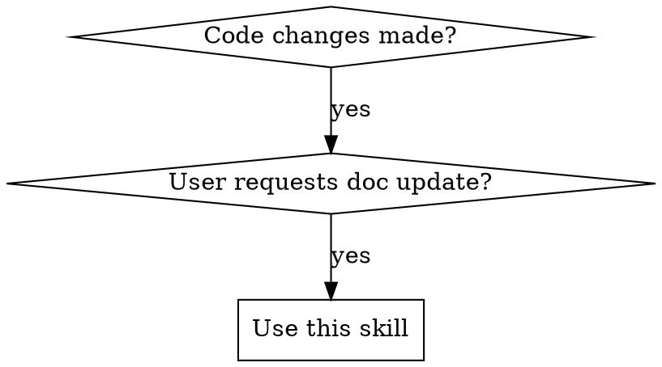

# Claude Change Documentation

## Overview

Keeps `.claude/` directory documentation synchronized with code changes. The `.claude/` directory uses a four-layer structure (instructions.md, rules/, project/, frame/) that must stay in sync with the codebase.

## When to Use



**Use when:**
- User explicitly asks: "update docs in .claude/", "sync documentation", "update instructions.md"
- After adding/modifying components, APIs, or architecture
- After changing development conventions or patterns
- When code and documentation have diverged

**Don't use when:**
- Creating new documentation from scratch (use organizing-claude-docs)
- User hasn't requested documentation update
- Documentation is outside `.claude/` directory

## Quick Reference

| Code Change | Documentation Update |
|-------------|---------------------|
| New coding standard or constraint | Add to `/rules/coding.md` or relevant rule file |
| New component or pattern | Add to `/project/overview.md` or create `/frame/[framework].md` |
| API change | Update `/project/architecture.md` + framework-specific doc in `/frame/` |
| Architecture decision | Add to `/project/architecture.md` |
| Framework adoption | Create `/frame/[framework-name].md` |
| New utility function | Add to framework doc in `/frame/` or `/project/overview.md` |

## Core Pattern

### 1. Verify Code Changes First

Always read the actual code files to understand what changed. Don't rely solely on user descriptions.

```
git diff or read files → identify exact changes → verify implementation
```

### 2. Map Changes to Documentation Layers

**For each changed file:**
1. Identify the change type (rule, architecture, framework-specific, etc.)
2. Determine which layer it affects (rules/, project/, frame/)
3. Find corresponding documentation in `.claude/`

**Documentation mapping:**
```
Code Change Type                  → .claude/ Location
─────────────────────────────────────────────────────────────
Coding standards/constraints      → /rules/coding.md
Security/safety requirements      → /rules/safety.md
Architecture decisions            → /project/architecture.md
Project goals/overview            → /project/overview.md
Timeline/planning                 → /project/roadmap.md
Framework-specific patterns       → /frame/[framework].md
Tech stack conventions            → /frame/[tech].md
Claude identity/behavior changes  → instructions.md
```

### 3. Update Four-Layer Structure

**Layer 1: instructions.md**
- Update only when Claude's identity or default behaviors change
- Use descriptive text to explain directory relationships
- NO @ references to other files

**Layer 2: /rules/** (Non-negotiable constraints)
- Update when adding/removing coding standards
- Update when changing security or safety requirements
- Update when modifying documentation conventions

**Layer 3: /project/** (Goals & Architecture)
- `/project/overview.md`: Update when adding new components or features
- `/project/architecture.md`: Update when system design changes
- `/project/roadmap.md`: Update when timelines or milestones change

**Layer 4: /frame/** (Tech Stack & Frameworks)
- Update when adopting new frameworks or libraries
- Update when changing framework-specific patterns
- Update when modifying tech conventions

**Update order:**
1. Update detailed documentation first (rules/, project/, frame/)
2. Then update instructions.md if directory relationships changed
3. Verify consistency across all layers

### 4. Verification Checklist

After updating documentation, verify:

- [ ] All changed code has corresponding documentation updates
- [ ] Correct layer chosen (rules/project/frame)
- [ ] API signatures match (parameter names, types, defaults)
- [ ] Examples are accurate and runnable
- [ ] No duplication across layers
- [ ] instructions.md uses descriptive text (no @ references)
- [ ] TypeScript types/interfaces documented (if applicable)
- [ ] Test files checked for usage patterns (if they exist)
- [ ] No outdated information remains

## Implementation

### Step 1: Analyze Changes
```bash
# Check git diff or read changed files
git diff src/
# or
Read src/components/Button.tsx
```

### Step 2: Determine Which Layer to Update

Ask classification questions:
- "Is this a non-negotiable constraint?" → /rules/
- "Is this about WHY or WHAT (goals/architecture)?" → /project/
- "Is this tech-specific (how to use X)?" → /frame/
- "Does this change Claude's identity or directory relationships?" → instructions.md

### Step 3: Find Documentation
```bash
# Locate related docs
Glob ".claude/**/*.md"
Grep "Button" .claude/
```

### Step 4: Update Documentation
Update the appropriate layer file(s).

### Step 5: Verify
Cross-reference code and documentation for consistency.

## Common Mistakes

| Mistake | Fix |
|---------|-----|
| Updating only one layer, missing others | Update all affected layers (rules/project/frame) |
| Putting framework content in /rules/ | Move to /frame/ |
| Putting goals in /rules/ | Move to /project/ |
| Using @ references in instructions.md | Use descriptive text instead |
| Not verifying actual code changes | Read code files before updating docs |
| Duplicating content across layers | Choose primary purpose, reference in prose |
| Forgetting to update API signatures | Check parameter names, types, defaults |
| Leaving outdated information | Remove or update all references to changed APIs |
| Missing TypeScript interfaces | Copy relevant type definitions to docs |
| Not checking test files | Test files reveal actual usage patterns |

## Edge Cases

**Code changes not yet implemented:**
If the described changes don't exist in code yet, ask user: "Should I wait for implementation, or document planned changes?"

**Multiple layers affected:**
Update all affected layers in one pass to maintain consistency. Example: A new framework adoption might require updates to `/frame/[framework].md`, `/project/architecture.md`, and potentially `/rules/coding.md` if it introduces new standards.

**Breaking API changes:**
Update `/project/architecture.md` for the architecture impact and the relevant `/frame/` doc for implementation details. Consider adding a changelog to `/project/roadmap.md`.

**Content fits multiple layers:**
Use the primary purpose test:
- Constraint regardless of tech → /rules/
- Tech-specific implementation → /frame/
- Goals/architecture decisions → /project/
- Choose one, reference others in prose

**Emergency updates during incidents:**
Accept temporary placement, add TODO comment for later reorganization. Example: `<!-- TODO: Move to /rules/api-safety.md after incident -->`

## Real-World Impact

Before this skill:
- Documentation drifts from code implementation
- Agents update one layer but miss related documentation
- Content placed in wrong layer (rules vs project vs frame)
- Inconsistent documentation structure

After this skill:
- Systematic four-layer updates
- Clear mapping between code types and documentation layers
- Verification prevents documentation drift
- Correct layer classification prevents ambiguity
