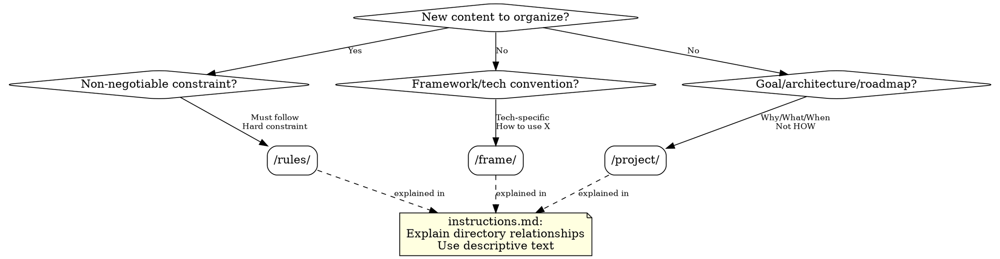

# Organizing Claude Docs

## Overview

Standardizes `.claude/` directory structure with clear classification rules. Prevents ambiguous file placement, inconsistent structure, and content duplication by defining four distinct layers with specific purposes.

## When to Use



**Use when:**
- Creating new .claude/ documentation
- Deciding where to place content in .claude/ directory
- Restructuring or reorganizing existing .claude/ files
- User asks "where should this go?"
- Fixing inconsistent .claude/ structure

**Don't use when:**
- Updating existing docs after code changes (use claude-change-documentation)
- Creating documentation outside .claude/ directory
- User already has clear .claude/ structure

## The Four-Layer Structure

### Layer 1: instructions.md (Root Node)

**Purpose:** Explains what each directory contains and why they exist.

**Content:**
- Claude's identity and default behaviors
- Descriptive explanation of each directory's purpose
- How directories relate to each other

**Critical Rules:**
- Use descriptive prose (NOT @ references)
- Don't repeat content from subdirectories
- Don't make it a "quick access" dump

**Example:**
> "The /rules/ directory contains non-negotiable constraints like coding standards and safety requirements. These are hard rules that all agents must follow."

---

### Layer 2: /rules/ (Non-Negotiable Constraints)

**Purpose:** Pure rules - constraints that cannot be violated.

**Trigger question:** "Is this a must-follow constraint or a negotiable guideline?"

**Content types:**
- Coding standards (e.g., "Use TypeScript strict mode")
- Security requirements (e.g., "All API calls must include timeout headers")
- Safety guardrails (e.g., "Never run rm -rf on production directories")
- Documentation conventions (e.g., "All functions must have JSDoc")

**Decision test:** If breaking this causes immediate harm/violation, it's a rule.

---

### Layer 3: /project/ (Goals & Architecture)

**Purpose:** Project planning, goals, architecture decisions, and roadmap.

**Trigger question:** "Does this explain WHY or WHAT, not HOW?"

**Content types:**
- **overview.md**: What is this project? Who is it for?
- **architecture.md**: How do systems relate? (Not framework-specific)
- **roadmap.md**: When will features ship? What's the timeline?

**Confusion test:**
- "How to use FastAPI" → /frame/fastapi.md
- "Why we chose FastAPI" → /project/architecture.md

---

### Layer 4: /frame/ (Tech Stack & Frameworks)

**Purpose:** Framework-specific conventions, patterns, and how-to guides.

**Trigger question:** "Is this tied to a specific technology/framework?"

**Content types:**
- Framework conventions (e.g., /frame/fastapi.md)
- MCP server patterns (e.g., /frame/notion-mcp.md)
- Library usage (e.g., /frame/centrifugo.md)

**Decision test:** If replacing the technology removes the content, it belongs here.

## Quick Reference: Content Type → Directory

| Content Example | Correct Location | Why? | Common Mistake |
|----------------|------------------|------|----------------|
| "All functions must have JSDoc" | /rules/docs.md | Non-negotiable standard | /project/overview.md |
| "We use TypeScript for type safety" | /project/architecture.md | Architecture decision | /rules/ |
| "FastAPI routes must be async" | /frame/fastapi.md | Framework convention | /rules/ |
| "Timeout headers required for APIs" | /rules/api-safety.md | Non-negotiable constraint | /project/ |
| "Migrating to microservices in Q2" | /project/roadmap.md | Timeline/planning | /frame/ |
| "Notion MCP requires OAuth setup" | /frame/notion-mcp.md | Tech-specific setup | /rules/ |
| "Claude: helpful coding assistant" | instructions.md | Root node definition | /rules/ |
| "Goal: Build CLI for developers" | /project/overview.md | Project purpose | /rules/ |

## Organization Process

### Step 1: Identify Content Nature

Ask: "What type of content are you adding?"

**Listen for keywords:**
- "Must", "always", "never", "required" → Likely /rules/
- "Framework", "FastAPI", "React", "library" → Likely /frame/
- "Goal", "architecture", "roadmap" → Likely /project/
- "Explains", "relationship", "directory" → Likely instructions.md

### Step 2: Apply Classification Questions

**For /rules/:**
- "Is this non-negotiable?"
- "Would violating this cause immediate problems?"
- "Is this a hard constraint or a soft guideline?"

**For /frame/:**
- "Is this tied to a specific technology?"
- "Would this disappear if we swapped frameworks?"
- "Is this about 'how to use X'?"

**For /project/:**
- "Is this about WHY or WHAT, not HOW?"
- "Is this planning, architecture, or goals?"
- "Would this exist regardless of tech stack?"

**For instructions.md:**
- "Does this explain directory relationships?"
- "Is this about Claude's identity/behavior?"
- "Are you using descriptive text (not @ references)?"

### Step 3: Verify No Duplication

**Check:** "Does this content already exist elsewhere?"

- If yes: Remove duplication, clarify ownership
- If ambiguous: Choose primary purpose, reference in prose

**Example:**
- Don't put FastAPI patterns in both /frame/fastapi.md AND /project/architecture.md
- Choose ONE: "How to use FastAPI" vs. "Why we chose FastAPI"

### Step 4: Create or Update File

**File creation checklist:**
- [ ] Correct directory chosen
- [ ] Filename is descriptive (e.g., api-safety.md, not rule1.md)
- [ ] Content matches directory purpose
- [ ] No duplication with existing files

### Step 5: Update instructions.md (if needed)

**When:** Creating NEW file or directory

**Template:**
```markdown
## [Directory Name]

[One sentence explaining purpose]. [Relationship to other directories].

Example: "The /rules/ directory contains non-negotiable constraints that all agents must follow. These are hard rules, not guidelines. See individual rule files for specifics."
```

## Common Mistakes

| Mistake | Why It's Wrong | Fix |
|---------|----------------|-----|
| Putting rules in /project/ | /project/ is for goals, not constraints | Move to /rules/ |
| Duplicating content across directories | Violates single source of truth | Choose primary purpose |
| Using @ references in instructions.md | Violates "descriptive text" principle | Use prose to explain |
| Framework-specific content in /rules/ | Not all agents use that framework | Move to /frame/ |
| Project goals in /rules/ | Goals are aspirations, not constraints | Move to /project/ |
| Making instructions.md a summary dump | Bloates root, defeats structure | Keep focused on relationships |
| Confusing "architecture" with "framework" | Architecture = system design; Framework = tech choice | /project/architecture.md for design, /frame/ for tech |
| Neglecting to update instructions.md | New files lack context | Add relationship explanation |

## Edge Cases

### Content That Fits Multiple Directories

**Apply the primary purpose test:**
1. Ask: "What is the PRIMARY reason this exists?"
2. If constraint regardless of tech → /rules/
3. If tied to specific framework → /frame/
4. Reference in other location if needed

**Example:**
- "All FastAPI routes must have timeouts" → /frame/fastapi.md
- "All external API calls must have timeouts" → /rules/api-safety.md

---

### Emergency Content Placement

**Problem:** "We need to document this NOW during an incident!"

**Solution:**
1. Accept temporary placement for speed
2. Add TODO: `<!-- TODO: Move to correct directory after incident -->`
3. Explain proper location
4. Follow up when urgency passes

---

### "Is this a rule or a project goal?"

**Ask:** "What happens if this isn't followed?"
- Immediate failure/violation → /rules/
- Aspiration/target → /project/roadmap.md

**Example:**
- "All production code must have tests" → /rules/
- "Aim for 90% coverage by Q3" → /project/roadmap.md

---

### Founder Wants "Quick Access" Summaries

**Solution:**
1. Explain structure's purpose
2. Offer alternative: Create /README.md for human navigation
3. Don't bloat instructions.md with @ references
4. Use clear descriptions for mental mapping

**Example instructions.md:**
```markdown
## /rules/
Contains all non-negotiable constraints. Quick reference:
- coding.md: TypeScript, linting, formatting
- safety.md: Security requirements and guardrails
- docs.md: Documentation and JSDoc requirements
```

## instructions.md Template

```markdown
# Claude's Identity & Purpose

[Brief paragraph explaining who Claude is for this project and default behaviors]

---

## Directory Structure

This project uses a four-layer .claude/ structure to organize context and constraints.

### /rules/

Contains non-negotiable constraints that all agents must follow, including coding standards, safety requirements, and documentation conventions. These are hard rules, not guidelines.

### /project/

Contains project planning documents: overview (what/who), architecture (how systems relate), and roadmap (when/timeline). Focuses on WHY and WHAT, not HOW.

### /frame/

Contains framework and technology-specific conventions: how to use FastAPI, Notion MCP setup, centrifugo patterns. Content here would disappear if we swapped technologies.

---

## How Directories Relate

These directories are peers, not a hierarchy. Priority depends on context:
- Rules from /rules/ always apply
- /project/ explains goals and architecture
- /frame/ provides tech-specific implementation guidance
- Claude dynamically judges which takes precedence based on context

---

## Default Behaviors

[List any default behaviors or preferences]

Example: "By default, Claude prefers TypeScript strict mode, functional component patterns, and async/await over promises. These are documented in /rules/coding.md."
```

## Real-World Impact

**Before this skill:**
- Rules mixed with goals in /project/
- Framework conventions treated as universal rules
- instructions.md bloated with @ references
- "Where does this go?" asked repeatedly

**After this skill:**
- Clear four-layer structure with distinct purposes
- Classification questions prevent ambiguity
- instructions.md explains relationships without duplication
- Consistent organization across projects
